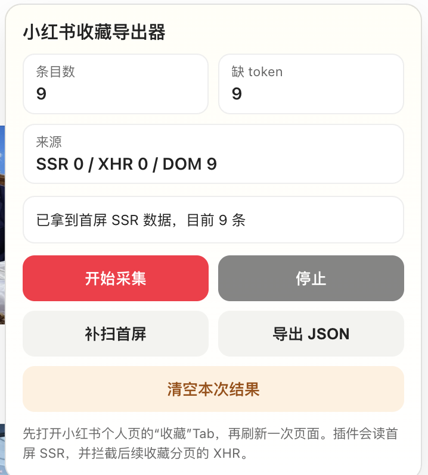

# 小红书收藏导出器

<p align="center">
    <a href="https://linux.do/t/topic/1777230" alt="LINUX DO">
        
    </a>
</p>

一个 Chrome 扩展，在真实登录态下把小红书「收藏」列表里的笔记条目导出为结构化 JSON。

不重放私有 API，不需要抓包，不存储密码。它只是在你已经登录的页面里，把你自己的收藏数据整理出来。

## 它能做什么

- 读取首屏 SSR 数据（`__INITIAL_STATE__`），拿到第一批收藏
- 拦截页面自身发出的收藏分页 XHR，捕获后续每一页
- 自动滚动收藏页，持续触发分页加载
- 同时扫描 DOM 卡片作为补充数据源
- 三种来源（SSR / XHR / DOM）自动去重合并
- 一键导出 JSON 文件

每条记录包含：

| 字段 | 说明 |
|------|------|
| `note_id` | 笔记 ID |
| `xsec_token` | 访问令牌（详情页需要） |
| `url` | 完整链接，可直接打开 |
| `title` | 标题 |
| `author` | 作者昵称 |
| `cover` | 封面图链接 |
| `liked_count` | 点赞数 |
| `note_type` | 笔记类型（normal / video） |
| `sources` | 数据来源（ssr / xhr / dom） |

## 安装

1. 下载或 clone 本仓库
2. 打开 Chrome，进入 `chrome://extensions`
3. 右上角打开「开发者模式」
4. 点「加载已解压的扩展程序」，选中本项目目录

## 使用

1. 打开小红书，登录你的账号
2. 进入个人主页 → 点「收藏」Tab
3. **刷新一次页面**（很重要，确保插件的注入脚本在页面 JS 之前运行）
4. 右下角会出现控制面板
5. 点「开始采集」
6. 等它自动滚动采集完毕（滚到底部且连续多轮无新增时会自动停止）
7. 点「导出 JSON」

<p align="center">
  
</p>

## 导出格式

```json
{
  "exported_at": "2026-04-13T12:00:00.000Z",
  "page_url": "https://www.xiaohongshu.com/user/profile/...",
  "total_items": 87,
  "missing_token_count": 3,
  "page_info": {
    "cursor": "...",
    "has_more": false
  },
  "items": [
    {
      "note_id": "6805d5dc000000001c0328ce",
      "xsec_token": "ABCD1234",
      "url": "https://www.xiaohongshu.com/explore/6805d5dc000000001c0328ce?xsec_token=ABCD1234",
      "title": "示例标题",
      "author": "示例作者",
      "cover": "https://...",
      "liked_count": "12",
      "note_type": "normal",
      "sources": ["ssr", "xhr"]
    }
  ]
}
```

## 技术原理

```
┌─────────────────────────────────────────────┐
│  page-bridge.js（页面上下文）                 │
│                                             │
│  1. 读 __INITIAL_STATE__ → 首屏 SSR 数据     │
│  2. monkey-patch XMLHttpRequest             │
│     拦截 /api/sns/web/v2/note/collect/page  │
│  3. 通过 postMessage 传给 content script     │
│                                             │
├─────────────────────────────────────────────┤
│  content-script.js（扩展上下文）              │
│                                             │
│  1. document_start 注入 page-bridge.js      │
│  2. 扫描 DOM 卡片（a[href*="/explore/"]）    │
│  3. 自动滚动触发分页                          │
│  4. 三源去重合并                              │
│  5. 渲染控制面板（Shadow DOM）                │
│  6. 导出 JSON                               │
└─────────────────────────────────────────────┘
```

关键设计决策：

- **为什么用两层脚本？** content script 能操作 DOM 但访问不了页面 JS 的全局变量（`__INITIAL_STATE__`、`_webmsxyw` 等）。page-bridge 通过 `<script>` 标签注入到页面上下文，能直接读写页面变量。两层之间用 `postMessage` 通信。
- **为什么要在 `document_start` 注入？** 小红书的收藏数据通过 SSR 和首次 XHR 加载。如果在 `document_idle` 才注入，第一批请求已经发完了，拦截不到。
- **为什么 patch XHR 而不是 fetch？** 小红书 Web 端用的是 XMLHttpRequest（通过 axios），不是原生 fetch。
- **为什么不直接调 API？** 小红书 API 有三重签名（X-s / X-t / X-S-Common），其中 X-S-Common 由 axios 拦截器注入，外部无法轻松复现。与其逆向签名算法，不如直接拦截页面自己发出的合法请求。

## 关于导出链接的风控提示

导出的 JSON 里每条链接都是正确的，但如果你直接从外部（比如 Finder 里双击 JSON、从备忘录里点链接）打开某条 `url`，小红书可能会弹出风控页面，要求手机 APP 扫码验证。

这不是链接本身的问题，而是小红书的**会话级风控机制**：

- 小红书页面加载时会跑一组初始化请求（`shield/webprofile`、`scripting`、`sbtsource` 等），这些请求会在 cookie 里写入会话级的信任标记
- 从页面内正常跳转时，这些标记都在，风控放行
- 从外部直接打开链接时，缺少这些标记，触发风控拦截

**解决办法很简单：** 先在浏览器里随便打开一个小红书页面（比如你的收藏主页），等页面加载完，再从同一个浏览器里打开导出的链接，就不会被拦了。本质上就是让风控 SDK 先"签到"一次，激活信任会话。

## 已知限制

- 这版只做收藏列表枚举，不抓笔记正文、全部图片和评论
- 少数只从 DOM 扫到的卡片可能缺少 `xsec_token`
- 首屏数据依赖注入时机，启用插件后必须刷新一次收藏页
- 自动滚动采用保守节奏（~1.4 秒/轮），可靠性优先
- 不支持「收藏夹」（分组收藏），目前只支持默认收藏列表

## 后续可以做什么

导出的 JSON 是一份干净的笔记索引。可以用它：

- 喂给内容抓取脚本，逐条拉正文和图片
- 接 MCP 工具链，做结构化存档
- 写个简单脚本按关键词筛选（比如只要越南旅游相关的）
- 作为个人知识管理的数据源

## 文件说明

| 文件 | 说明 |
|------|------|
| `manifest.json` | Chrome Manifest V3 配置 |
| `content-script.js` | 控制面板 UI、自动滚动、去重合并、导出 JSON |
| `page-bridge.js` | 页面上下文脚本，读 SSR 数据、拦截 XHR |

## License

MIT
